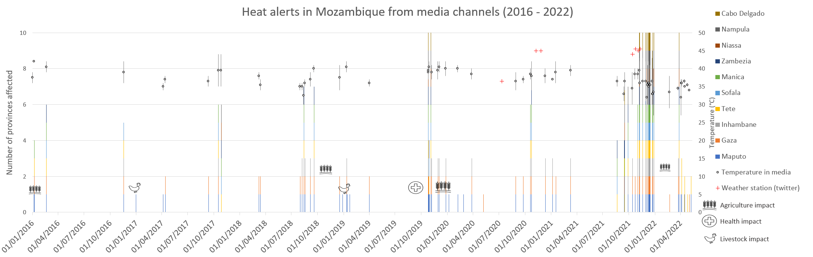
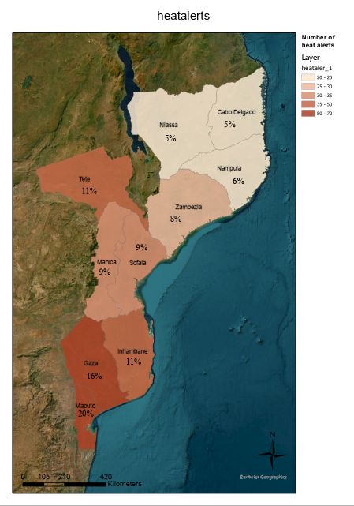
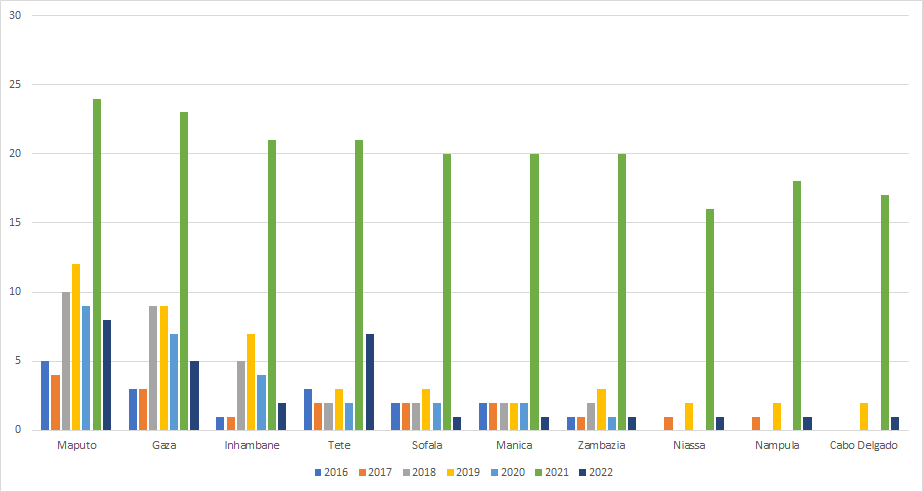

```{r setup, include=FALSE}
knitr::opts_chunk$set(echo = TRUE)

def.chunk.hook  <- knitr::knit_hooks$get("chunk")
knitr::knit_hooks$set(chunk = function(x, options) {
  x <- def.chunk.hook(x, options)
  ifelse(options$size != "normalsize", paste0("\n \\", options$size,"\n\n", x, "\n\n \\normalsize"), x)
})
```

```{r logo, eval=TRUE, echo=FALSE, message=FALSE, warning=FALSE, fig.align='center', out.width='0.3\\linewidth', fig.pos='H'}
temp <- tempfile(fileext = ".pdf")
download.file(url = "https://reproducible-agile.github.io/public/images/reproducible-AGILE-logo-square.pdf", destfile = temp)
knitr::include_graphics(temp)
```

This report is part of the reproducibility review at the AGILE conference.
For more information see [https://reproducible-agile.github.io/](https://reproducible-agile.github.io/).
This document is published on OSF at [https://doi.org/10.17605/osf.io/eu8kw](https://doi.org/10.17605/osf.io/eu8kw).
To cite the report use

Koukouraki, E. (2023, April).  Reproducibility review of: Extreme heat alerts and impacts across Mozambique 2016 - 2022: gathering evidence from media articles. [https://doi.org/10.17605/OSF.IO/EU8KW](https://doi.org/10.17605/OSF.IO/EU8KW)

# Reviewed paper

Pereira Marghidan, C., van Aalst, M., Blanford, J., Maure, G., and Marrufo, T. (2023). Extreme heat alerts and impacts across Mozambique 2016 - 2022: gathering evidence from media articles, AGILE Conference

# Summary

The paper elaborates on the data collection about extreme heat alerts in Mozambique from different media sources and subsequently overlays the collected datasets. After manual data collection, the data were gathered and analysed in spreadsheets and then shared via Github under CC BY 4.0. For this reproducibility review, we attempted to reproduce Figures 1-4 and Table 2. Since the data processing steps were not detailed enough in the README files provided by the corresponding author, in most cases we managed to do a verification of the results, rather than a reproduction. For this reason, the reproduction of this paper can be considered only **partially successful**.

\clearpage

# Reproducibility reviewer notes

## Data sharing

The materials that were used for the elaboration of this study were made publicly available under CC BY 4.0 via the following Github repository: [https://github.com/carolinamarghidan/AGILE_MZ_Heat](https://github.com/carolinamarghidan/AGILE_MZ_Heat). The repository consists of a README with links to the data files that are necessary to reproduce the figures of the paper. 

**Dataset 1** is a spreadsheet that compiles and analyses temperature related records from several media sources that can be found online (Twitter, Facebook, Club of Mozambique, Rádio Moçambique, O País, and Televisão de Moçambique). The spreadsheet containes data about: Date of post, Location (district),	Province, Maximum temperature recorded in media, Maximum temperature from weather station,	Impacts recorded (eg. on agriculture), Other information about weather conditions	of the heat wave, Duration in days,	Recommendations	for citizens, Link to online article and Source outlet. There are also three more spreadsheets that were shared upon the reproducibility committee's request for more detailed information about how the figures of the paper were produced: Hwalert_figure2.xlsx (Heat alerts over time - Figure 2), Hwalert_figure1_3.xlsx (Heat alerts per province - Figures 1 and 3) and agile_fig4.xlsx (Maputo and Cabo Delgado weather stations - Figure 4). Based on these spreadsheets, we were able to verify the connection of the figures with the data, but there were not enough instructions to produce the figures on our own based only on the initial dataset that was provided (Dataset 1). The correspondence author included a README to each one of these spreadsheets, which serves more like a short description, rather than a data transformation instruction sheet.

The README also points to two external data portals: 1) The Humaninarian Data Exchange portal for the shapefile with the administrative boundaries of Mozambique ([https://data.humdata.org/dataset/cod-ab-moz](https://data.humdata.org/dataset/cod-ab-moz)), and 2) the National Centers for Environmental Information of the United States for the Weather station recorded Daily maximum temperatures [https://www.ncei.noaa.gov/access/search/datasearch/daily-summaries](https://www.ncei.noaa.gov/access/search/datasearch/daily-summaries). In the first portal we downloaded the file named _moz_adm_20190607b_SHP.zip_ (accessed on March 6th, 2023). In the second portal, after clicking _Explore datasets_ we filled the values "maximum temperature" for _What_ and "Mozambique" for _Where_, as instructed by the README. From the automatically generated results by the portal, we selected the option _Search Data_ of the _Global Historical Climatology Network - Daily (GHCN-Daily), Version 3_ dataset. Then we downloaded the .csv files for the provinces Maputo, Xai-Xai, Panda, Inhambane, Chimoio, Beira, Tete, Quelimane, Nampula, Lichinga, and Pemba, as instructed by the README. These .csv files comprise the so called **Dataset 2**, uploaded also to the corresponding OSF component.

After the reproducibility review, the Github repository was forked and archived under the official Reproducible AGILE Github organization:[https://github.com/reproducible-agile/AGILE_MZ_Heat](https://github.com/reproducible-agile/AGILE_MZ_Heat).

For the reproduction of Figure 2, the correspondence author shared with the reproducibility committee one .mxd file (Map Exchange Document) and one shapefile that were necessary over e-mail.

## Software used

For the reproduction of Figure 2, we used ArcGIS Pro, and for the verification of Figures 1, 3 and 4 we used Microsoft Excel.

## Reproduced figures

All the reproduced figures are listed below.

### Figure 1
The reproduced figure is quite similar to the one included in the paper, but not exactly the same. There are some differences of aesthetic nature, such as the font and the color scheme, that appears slightly lighter on the reproduced figure. The original figure does not have a title (minor importance) and the explanations of some symbols are missing in the legend on the bottom right corner. Furthermore, some of the plotted data for the heatwave impacts (on agriculture, health and livestock) are positioned differently in the reproduced figure. The rest of the data are in accordance with the original figure. This figure was extracted from the spreadsheet Hwalert_figure1_3.xlsx.

```{r, echo=FALSE,out.width="100%",fig.cap="Corresponds to Figure 1 of the paper",fig.show='hold',fig.align='center'}

```

### Figure 2
The reproduced figure has a different title and also two additional subtitles for the layers shown in the legend. Both differences are considered of minor importance, since especially the latter could possibly be configured in the GUI of ArcGIS Pro. The two figures make use of different basemaps, which results in obvious (but consistent) differences in the color scheme of the sea and different citation on the bottom right corner of the figure. For the reproduction of this figure we had to connect three different files in ArcGIS Pro.

```{r, echo=FALSE,out.width="60%",fig.cap="Corresponds to Figure 2 of the paper",fig.show='hold',fig.align='center'}

```

### Figure 3
The reproduced figure demonstrates the same plotted data as the original one. The differences are minor and consist of the missing title, the fonts and the ranges of the axes. This figure was extracted from the spreadsheet Hwalert_figure1_3.xlsx.

```{r, echo=FALSE,out.width="65%",fig.cap="Corresponds to Figure 3 of the paper",fig.show='hold',fig.align='center'}

```

### Figure 4
This figure has two parts, which for the needs of this report we named 4a (upper - concerning Cabo Delgado) and 4b (lower - concerning Maputo city). We were only able to verify figure 4a, as for figure 4b we ran into a "Source not found" error in Microsoft Excel. The reproduced Figure 4a seems to depict the same data as the original, as far as we could judge with the low quality of the image that was embedded in the paper. The differences are minor and include a differently placed legend and different date format in the x-axis. 
This figure was extracted from the spreadsheet agile_fig4.xlsx.

```{r, echo=FALSE,out.width="100%",fig.cap="Corresponds to Figure 4 of the paper",fig.show='hold',fig.align='center'}
knitr::include_graphics(c('./reproduced/figure4a.png','./reproduced/figure4b.png'))
```

## Reproduced table

Apart from the figures, we reproduced Table 2 of the paper, which gathers information about extreme temperatures in Mozambique from a specific Twitter account (@extremetemps - [https://twitter.com/extremetemps](https://twitter.com/extremetemps)). We used the _Advanced Search_ feature of Twitter ([https://twitter.com/search-advanced](https://twitter.com/search-advanced)), filling in the queries "Mozambique" for _All of these words_, "@extremetemps" for _From these accounts_, "1/1/2016" for _From_ and "1/1/2022" for "To" Dates (excluding replies of the account to tweets of other accounts).
The steps for this reproduction were assumed based on the methodology described in the paper. The data collection on our side happened on March 2nd, 2023. We were able to verify 6 out of 7 entries of the table and we informed the correspondence author accordingly, who answered that this entry would be eventually be removed from the final version of the manuscript. This should also affect Figure 1, as it plots data from Twitter. The rest of the records are in accordance with the ones reported in the paper with regards to the date and the side notes. We identified a small numerical difference for the temperature record of 03/11/2021 and we could not verify the geographical subregion for the record of 11/07/2020. The Table can be seen below:

```{r, echo=FALSE,out.width="50%",results='asis'}
tab <- matrix(c("11/07/2020", "", 36.5, "new national July Tmax", 
                "08/11/2020", "", 45, "",
                "25/11/2020", "Northern Mozambique", 45, "", 
                "24/10/2021", "Tete", 45.5, "Southern hemisphere highest",
                "03/11/2021", "", 44.2, "",
                "09/11/2021", "Tete", 45.5, "Southern hemisphere highest"), ncol=4, byrow=TRUE)
colnames(tab) <- c('Date','Location','Maximum temperature (ºC)', 'Notes') 
rownames(tab) <- NULL
# tab <- as.table(tab)
knitr::kable(tab, caption="Corresponds to Table 2 of the paper")
```

## Communication with the author

To achieve such level of reproducibility for this paper, multiple rounds of communication with the correspondence author were required. Although the Github looked much simpler at the beginning of the reproducibility review, the correspondence author was very cooperative and willing to share the necessary information with the reproducibility committee upon request. This resulted to a considerably improved Github README that will hopefully be helpful to future data reuse and methodology replications. 

## Reproduction efforts

The reproducibility review took more than four full days (expanded to several weeks), which is much longer than expected. The figure reproduction requirements were not clear from the beginning, the instructions for (re)producing them were lacking or even misleading at times. This resulted to several reproduction efforts that eventually failed. After communicating the failed reproduction results to the correspondence author, they helped us by providing more clues for eventually verifying (and partially reproducing) Figures 1-4 and Table 2. Furthermore, not all datasets were mentioned in the first version of neither the _Data and Software Availability_ section nor the Github README. 


```{r, echo=FALSE, eval=FALSE, results='hide'}
# create ZIP of reproduction files and upload to OSF
library("zip")
library("here")

zipfile <- here::here("PATH/agile-reproreview-YEAR-NUMBER.zip")
file.remove(zipfile)
zip::zipr(zipfile,
          here::here("2020-018/files to add to the zip, if any"))

library("osfr") # See docs at https://docs.ropensci.org/osfr/
# OSF_PAT is in .Renviron in parent directory
# We cannot use osfr to create a new component (with osfr::osf_create_component(x = osfr::osf_retrieve_node("6k5fh"), ...) because that will set the storage location to outside Europe.

# retrieve project
project <- osfr::osf_retrieve_node("OSF ID")

# upload files
osfr::osf_upload(x = project,
                 conflicts = "overwrite",
                 path = c(list.files(here::here("PATH"),
                                     pattern = "agile-reproreview-.*(pdf$|Rmd$|zip$)",
                                     full.names = TRUE),
                          "COPYRIGHT"
                          )
                 )
```